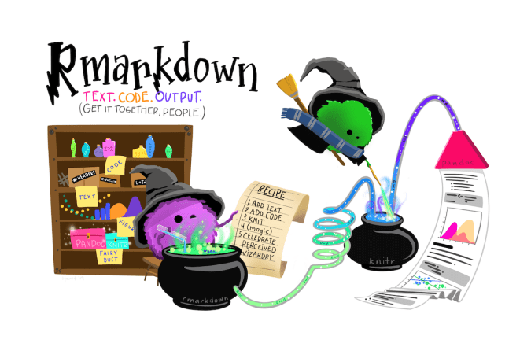

-----------------------
```{=tex}
\newpage 
\hypersetup{linkcolor=black}
\renewcommand*\contentsname{Index.}
\tableofcontents
```


\newpage


# Introduction.

## YouTube installation guides.

As you may understand, R and RStudio versions are frequently updated and people regularly upload installation guides on YouTube. If you find a newer video for installing a newer version please share. In any case, these videos can definitely help you as a guide to install the newer version available.

-   [Download & Install R 3.6.3](https://youtu.be/3OxPMYP8lNU)
-   [Download & Install RStudio Desktop 1.3.959](https://youtu.be/uvnuQ_fKrMc)
-   [Installing R and Rstudio on MacOS.](https://youtu.be/Y20P3u3c_1c)
-   [Orientation and Setting up R (Setting up R)](https://www.youtube.com/watch?v=y2wgdw5_MZg&t=2498s)
-   [Orientation and Setting up R (Setting up RStudio)](https://www.youtube.com/watch?v=y2wgdw5_MZg&t=3002s)
-   [RStudio: A Guided Tour (by Jamison Crawford).](https://youtu.be/xgPwDlAtuNI)
-   [How to Install RStudio (and Knit to PDF).](https://youtu.be/2Sovzf6lVRo)
-   [RStudio: Explaining the Interface & R Markdown.](https://youtu.be/AHAR7j-IUOw)
-   [How to Connect RStudio with Git (Github) for Cloning and Pushing Repo.](https://youtu.be/lXwH2R4n3RQ)

## RStudio and GitHub integration plus pull request (PR).

Here, we assume you have installed R, RStudio, Git, and you have a GitHub account. This series of videos are good to understand the basics of how professionals develop code in a collaborative way.

**Video 1 of 4.** I recommend you to start at minute 10. Before minute 10 you can see an installation process, but there are better videos in the previous section (YouTube installation guides). Starting from minute 10 you can learn how to link RStudio with your GitHub account using the SSH RSA key which I highly recommend. You may find Samsun's voice speed a bit slow, just remember you can change the playback speed in YouTube if necessary. [Installing R, R Studio, and link R Studio with Github account - Part 4 - by Samsun.](https://youtu.be/-LKFxtaU5bY)

**Video 2 of 4.** The relevant part starts at minute 5:50. In the first part Lisa explains how to use the `{usethis}` library to link RStudio with your GitHub account, but I recommend you to follow the video 1 for that purpose. So, please watch this from minute 5:50 to the end. There is one more thing, in 8:39 she clones with HTTPS, but I recommend you cloning with SSH, the option to select SSH is just right there in the same window. In my experience, cloning with SSH is better because of security issues and because you may not be asked to log in repeatedly. [Using git and GitHub in R Studio.](https://youtu.be/QLFc9gw_Hfs)

**Video 3 of 4.** Video 2 explained RStudio and GitHub integration to work alone. This video 3 explains how to work with others as collaborators (Lisa and Heather). In the context of this class, your classmate colleagues are collaborators, I am not included as a collaborator. Note that Lisa and Heather cloned with HTTPS but I recommend cloning with SSH. They show how to work with branches and pull request between collaborators. Starting from 30:40 the tutorial is somewhat less interesting, you are free to look at it, but it is not vital for our purposes. [Using Git and GitHub in R (second part).](https://youtu.be/megZYkCLMA4)

**Video 4 of 4.** Layla explains very well how to interact between a team of students and your professor or instructor. Note that her RStudio panes are in a very weird location but I guess you still can follow. Layla also recommends working with branches, this is a good practice. She also knits in html but I will ask you to knit in pdf most of the time. Note that she actually takes the side of the students who are interacting with an instructor which is called reviewer in GitHub. [Branching and Committing from RStudio and creating a PR on GitHub.](https://youtu.be/4Jjk_43g9xU)

**Complementary video.** This is in Spanish, it is a good video, but the previous 4 are somewhat better. She links RStudio and GitHub using the terminal, I normally follow the procedure in the first video (Samsun's video). She also clones with HTTPS, but I recommend you cloning with SSH as I explained before. [RStudio y GitHub: control de versiones. ](https://youtu.be/Xy_CLr7htfA)


## Where to start?

Consider the following specific online and free resources to start or continue learning R:

- @mcnulty2021handbook: Chapter 2. The Basics of the R Programming Language.
- @hanck2020introduction: Chapter 1.2 A Very Short Introduction to R and RStudio.
- @Oswaldeconometrics: Chapter 1. Introduction to R.
- @heiss2020usingR: Chapter 1. Introduction.
- @de2015r: The book is available online.
- @peng2016r: The book is available online.
- @wickham2016ggplot2: The book is available online, this is for learning \texttt{ggplot}.
- @xie2021bookdown, @xie2020r and @xie2021r: The books are available online, these are for learning \texttt{rmarkdown}.
- @grolemund2018r: The book is available online, this is for learning about the tidyverse in R.
- To understand how R Markdown works: [R Markdown guidelines.](https://crd150.github.io/hw_guidelines.html)
- Thiyanga Talagala: [A detailed R Markdown guide.](https://talks-thiyanga.netlify.app/rmarkdown_rladies/rmarkdownrladies_tst#1)
- @bryan2018happy: The book is available online, this is for learning Git and GitHub.
- Probability, Statistics, and Data: A fresh approach using R. [Foundations of Statistics with R.](https://mathstat.slu.edu/~speegle/_book/)
- The references in the course calendar.
- As my student you have a free DataCamp account. You can find at least 151 courses
and 45 projects about R.
- Swirl teaches you R programming and data science interactively, at your own pace, and right in the R console. [Swirl.](https://swirlstats.com/)
- The \texttt{learnr} package makes it easy to turn any R Markdown document into an interactive tutorial. [Interactive Tutorials for R.](https://rstudio.github.io/learnr/)


```{r echo=FALSE, out.width="70%", fig.align="center"}
knitr::include_graphics('./datacamp.png')
```

## RStudio and GitHub.

```{r echo=FALSE, out.width="80%", fig.align="center"}
knitr::include_graphics('./Eh_CxAMXcAE82t5.png')
```

Illustration by Allison Horst.


## About me.

I am currently professor of finance and economics at UDEM. I regularly collaborate with The University of Manchester (Alliance Manchester Business School); the Centre for Financial and Management Studies (CeFiMS) at SOAS University of London, among others universities.

Let me introduce myself by listing my postgraduate studies and describing my professional background.

**My postgraduate studies:** I have a Post Doc in Finance from The University of Manchester; a PhD in Quantitative Finance from the University of the Basque Country; a Doctor *Europaeus* mention from several European universities: Manchester Business School; University of Edinburgh; Humboldt University; Aarhus University; University of Vienna; Dublin City University; Queen Mary, University of London; and University of St. Gallen. I was a Pre-doctoral Marie Curie research fellow at The Manchester Business School. I have seven postgraduate studies in Statistical Learning, Data Mining, Scientific Analysis of Data, Statistical Methods, Applied Statistics, Finance, and Quantitative Finance. I have a BS in Economics, and other professional certificates mostly in the area of data science from Strathclyde Business School, The Alan Turing Institute, among other European institutions.

**My professional background:** I have been a researcher in the area of quantitative finance for the last 10 years. My research has been published in 3 stars journals (high-ranked) according to The Chartered Association of Business Schools[^1], presented in numerous research seminars, and in prestigious international conferences. I have been a lecturer in economics, finance and data science for under and postgraduate levels at different universities in Mexico and the UK for the last 20 years. Also, I have supervised more than 70 dissertations at under and postgraduate academic programs of schools including the London School of Business & Finance; University of London, School of Oriental and African Studies (SOAS); The University of Manchester; Universidad Complutense de Madrid, UDEM, among others. I collaborate as reviewer and editor for several academic journals in the areas of finance and management. Also, I have experience in continuous education, consulting, and executive training in the area of finance.

[^1]: The Chartered Association of Business Schools is considered the voice of the UK's business and management education sector. According to ABS, all 3 stars rated journals publish original and well executed research papers and are highly regarded. These journals typically have good submission rates and are very selective in what they publish. Papers are heavily refereed in 3 stars rated journals.

My academic profile, including my full and updated curriculum vitae, can be found here:

```{r echo=FALSE, out.width="50%", fig.align="center"}

```

I love art, mainly painting and music, as the expression of human creativity and imagination. I spend some free time playing my Yamaha digital piano. I also used to be an active keyboardist, piano player, and orchestra director. Most of my experience in this field has been as a musician at live concerts in Mexico and Europe, piano solo concerts, and musicals organized by the Tecnológico de Monterrey (Campus Monterrey) for about a decade.


# Packages.

```{r echo=FALSE}
# This removes all items in environment. 
# It is a good practice to start your code this way.
rm(list=ls())
library(tictoc)
tic()
#date: "Last compiled on: `r format(Sys.time(), '%d/%m/%Y. %H:%M:%S')`"
```

```{r global_options, eval=FALSE, include=FALSE}
knitr::opts_chunk$set(warning=FALSE, message=FALSE)
knitr::opts_chunk$set(fig.pos = "H", out.extra = "")
```

```{r echo=FALSE, out.width="100%", fig.align="center"}
knitr::include_graphics('./1_B-cwhqnFgGIbd9lWnzi_mQ.png')
```

Load the relevant packages.

```{r message=FALSE,warning=FALSE}
library(mxmaps)
library(viridis)
library(scales)
library(ggplot2)
library(dplyr)
library(ggrepel)
library(readr)
library(tidyquant)
library(tidyr)
library(tidyverse)
library(imager)
library(purrr)
library(meme)
library(rayshader)
```

# Tidyverse verbs.

`{dplyr}` is a grammar of data manipulation, providing a consistent set of verbs that help you solve the most common data manipulation challenges. The following section is taken from Ben Stenhaug. See the following article:

https://teachingr.com/content/the-5-verbs-of-dplyr/the-5-verbs-of-dplyr-article.html

Five verbs of `{dplyr}`: `select()`, `filter()`, `arrange()`, `mutate()`, and `summarize()`.

Create a simple database to illustrate the value of the above verbs.

```{r}
hamsters <- data_frame(
  name = c("Aleydis", "Carolina", "América", "Plascencia", "Martín"),
  gender = c("female", "female", "female", "male", "male"),
  hamsters = c(5, 7, 6, 2, 1),
  hamster_cages = c(2, 1, 3, 3, 4))

hamsters
```

## Arrange.

`arrange()` function keeps all of the information in the data frame, but just changes the order of the rows. This is the same thing that the *sort* feature in Excel does.

By default, arranging happens in ascending order or from low to high:

```{r}
hamsters |> 
  arrange(hamsters)
```

We can instead arrange in descending order with the `desc()` function:

```{r}
hamsters |> 
  arrange(desc(hamster_cages))
```

Character columns get arranged in alphabetical order:

```{r}
hamsters |> 
  arrange(name)
```

If we input multiple column names, `arrange()` uses the additional columns to break ties.

```{r}
hamsters |> 
  arrange(hamster_cages)
```


```{r}
hamsters |> 
  arrange(hamster_cages, hamsters)
```

We could be interested to use the `spread()` function to spread the gender column into two new columns (female and male).

```{r}
spread(data = hamsters, key = gender, value = hamsters)
```


## Select.

`select()` function is used to choose which columns to work with. For example, maybe we want just the name and hamsters columns:


```{r}
hamsters
```

```{r}
hamsters |> 
  select(name, hamsters)
```

We can use a `-` to get rid of a column and leave the rest of the columns:

```{r}
hamsters |> 
  select(-name)
```

We also could have gotten just the name and hamsters columns by removing the `gender` and `hamster_cages` columns:

```{r}
hamsters |> 
  select(-gender, -hamster_cages)
```

`select()` can also be used to rearrange the order of columns:

```{r}
hamsters |> 
  select(hamsters, hamster_cages, gender, name)
```

`everything()` is a convenient shortcut that adds all the columns that haven't been used yet. It is very useful if you want to move a column to the front of a data frame:

```{r}
hamsters |> 
  select(hamster_cages, everything())
```

## Filter.

`filter()` function is used to select which rows you want. For example, maybe we only want students with more than 3 hamsters:

```{r}
hamsters |> 
  filter(hamsters > 3)
```

Notice that there is a variable named the same thing as the data frame. The first `hamsters` in the following code refers to the data frame, while the second `hamsters` refers to the `hamsters` column.

Or maybe we only want female students:

```{r}
hamsters |> 
  filter(gender == "female")
```

Notice that we had to use `==` instead of `=`. This is because `=` is for assignment (making something equal something else), whereas `==` is for comparison (seeing if two things are equal or not).

If we want to use an *and* (require that multiple conditions hold) we can either use the `&` sign or separate the conditions with a comma. For example, the following two filters are equivalent:

```{r}
hamsters |> 
  filter(gender == "female" & hamsters >= 6)
```

```{r}
hamsters |>  
  filter(gender == "female", hamsters >= 6)
```

If we want to use an *or* (require that just 1 of multiple conditions holds) we have to use the `|` sign. For example:

```{r}
hamsters |> 
  filter(gender == "male" | hamsters >= 7)
```

A case that commonly comes up is requiring that a variable has one of a set of specific values. For example, maybe we only want students with 2, 4, 6, or 8 hamsters.

The most intuitive way to do this is with a series of *or* statements:

```{r}
hamsters |> 
  filter(hamsters == 2 | hamsters == 4 | hamsters == 6 | hamsters == 8)
```
It gets tedious having to type and retype the word *hamsters* over and over again, though.

A nice shortcut is to supply the values you’re interested in as a vector by typing `c(2, 4, 6, 8)`, where the `c` stands for concatenate which basically means to glue 2 to 4 to 6 to 8 all together in one vector.

Once we have that vector we can simply check if the number of hamsters for that row is `%in%` the vector we created. Here's how that looks:

```{r}
hamsters |> 
  filter(hamsters %in% c(2, 4, 6, 8))
```
This can be a little bit confusing, so make sure you understand this. Think about the filter as happening row by row: first it checks the first row to see if 5 is in `c(2, 4, 6, 8)` – it isn't so it doesn't include that row. Then it checks the second row and also doesn't include that one because 7 isn't in the vector. It then checks the third row and keeps it because 6 is in there, and so on.

```{r echo=FALSE, out.width="100%", fig.align="center"}
knitr::include_graphics('./descarga.png')
```

## Filter with groups.

```{r}
hamsters
```

```{r}
hamsters |> 
  group_by(gender) |> 
  filter(max(hamster_cages) == 3)
```

We first grouped by gender. After that, every operation will happen at the group level instead of the row level.

The final line is where the magic happens. It tells R to return only the gender group where the max number of hamster cages is 3. This is the female group.

Notice that the male group isn't included because the max number of hamster cages is 4, not 3.

Similarly, we can get the gender group where the mean number of hamsters is 1.5. This time its the male group because there are two males – one with 1 hamster and the other with 2 hamsters.

```{r}
hamsters |> 
  group_by(gender) |> 
  filter(mean(hamsters) == 1.5)
```
The `n()` function is a shortcut for the number of rows in the group. So, the following code finds the gender group with 3 rows in it:

```{r}
hamsters |> 
  group_by(gender) |> 
  filter(n() == 3)
```
Of course, there isn't any reason that we have to group by gender. We could instead group by the number of hamster cages.

```{r}
hamsters
```


```{r}
hamsters |> 
  group_by(hamster_cages) |> 
  filter(n() == 1)
```

## Mutate.

So far, `arrange()` has sorted our data, `select()` has chosen which columns to work with, and `filter()` has sorted which rows to use. We haven't changed our data at all yet though – that's what `mutate()` does.

For example, maybe we want to create a new variable based on the number of hamsters per cage for each person:

```{r}
hamsters |> 
  mutate(hamsters_per_cage = hamsters / hamster_cages)
```

Note that this is the first time we can start to combine the `{dplyr}` verbs to really make some magic happen.

```{r}
hamsters |> 
  mutate(hamsters_per_cage = hamsters / hamster_cages) |> 
  arrange(hamsters_per_cage)
```

Or maybe we want an indicator of if the person has 5 or more hamsters:

```{r}
hamsters |> 
  mutate(five_or_more_hamsters = hamsters >= 5)
```

We can also use `mutate()` to input new data:

```{r}
hamsters |> 
  mutate(cats = c(4, 5, 2, 3, 1))
```

Of course, this only works if we give it the right amount of values:

```{r eval=FALSE, include=FALSE}
hamsters |> 
  mutate(dogs = c(1, 3, 5))
```

Interestingly, we can give it just 1 value and it will repeat it the correct number of times automatically:

```{r}
hamsters |> 
  mutate(walruses = 0)
```

We can create multiple new columns with one use of mutate if we separate each new column with a `,`:

```{r}
hamsters |> 
  mutate(hamsters_per_cage = round((hamsters / hamster_cages), 2),
         five_or_more_hamsters = hamsters >= 5)
```

Notice that `mutate()` leaves all of the original columns in the dataframe and adds new columns. If we instead use `transmute()` we'll only get the new columns:

```{r}
hamsters |> 
  transmute(hamsters_per_cage = hamsters / hamster_cages,
         five_or_more_hamsters = hamsters >= 5)
```

Slightly more complex things can be done by using values calculated from the data frame in the creation of a new column.

```{r}
hamsters |> 
  mutate(hamster_cages_centered = hamster_cages - mean(hamster_cages))
```

Notice that first the mean of the `hamster_cages` column is calculated to be 2.6, then the new column is created by subtracting 2.6 off of each value of the `hamster_cages` column.

## Mutate with groups.

Sometimes its useful to define new variables based on a group. Remember groups tell R to operate on the data frame one group at a time as opposed to using all of the rows in the data frame.

For example, examine the following – note how it's different from the code above:

```{r}
hamsters |> 
  group_by(gender) |> 
  mutate(hamster_cages_centered_by_gender = hamster_cages - mean(hamster_cages))
```

Before in `hamster_cages_centered` we subtracted the mean of `hamster_cages` which was 2.6 off of every value of `hamster_cages`.

Now, because we are grouping by gender, we subtract 2 off of `hamster_cages` for females and 3.5 off of `hamster_cages` for males. This is because `mean(hamster_cages)` operates on groups of rows defined by gender after we add the `group_by(gender)` attribute to the data frame.

## Summarize.

`mutate()` kept the same number of rows in the data frame and added a column.

We also want to be able to collapse rows of a data frame which we might think of summarizing. One of the most common ways to summarize a set of numbers is to take the mean:

```{r}
hamsters
```

```{r}
hamsters |> 
  summarize(hamsters_mean = mean(hamsters))
```
Another common method of summarizing is the median. We can summarize multiple variables with multiple functions at the same time:

```{r}
hamsters |>
  summarize(hamsters_mean = mean(hamsters),
            hamsters_median = median(hamsters),
            hamster_cages_mean = mean(hamster_cages),
            hamster_cages_median = median(hamster_cages))
```
## Summarize with groups.

Summarize isn't that useful by itself, but when we add groups it becomes powerful.

It allows us to get a summary row for each group in the data frame:

```{r}
hamsters
```

```{r}
hamsters |> 
  group_by(gender) |> 
  summarize(mean_hamsters = mean(hamsters))
```
Just as before, we can create multiple summary statistics all at once:

```{r}
hamsters |> 
  group_by(gender) |> 
  summarize(mean_hamsters = mean(hamsters),
            max_hamsters = max(hamsters),
            count = n())
```

## The power of combining verbs.

The true power of `{dplyr}` comes from combining these 5 verbs to solve problems. For example, see how we can piece commands together to do more and more complex operations:

```{r}
hamsters |>
  arrange(hamsters)
```

```{r}
hamsters |>
  arrange(hamsters) |> 
  select(-name) 
```

```{r}
hamsters |>
  arrange(hamsters) |> 
  select(-name) |> 
  mutate(walruses = 0)
```

```{r}
hamsters |>
  arrange(hamsters) |> 
  select(-name) |> 
  mutate(walruses = 0) |> 
  group_by(gender) |> 
  mutate(hamsters_centered_by_gender = hamsters - mean(hamsters))
```

```{r}
hamsters |>
  arrange(hamsters) |> 
  select(-name) |> 
  mutate(walruses = 0) |> 
  group_by(gender) |> 
  mutate(hamsters_centered_by_gender = hamsters - mean(hamsters))
```


```{r echo=FALSE, out.width="100%", fig.align="center"}
knitr::include_graphics('./tidydata_1.jpg')
```

# Measuring the skill of fund managers.

Fidelity Contrafund (FCNTX) is a mutual fund operated and provided by Fidelity Investments. Its current manager is William Danoff, who has headed the fund since 1990. Contrafund's AUM (assets under management) as of July 2015 total over 112 billion USD. See https://www.fidelity.com/

## Read the data.

Let's take the Kenneth R. French's Data Library to get the US market return:

https://mba.tuck.dartmouth.edu/pages/faculty/ken.french/data_library.html

The `{assemble}` function.

```{r Define funtion.}
# assemble makes the data ready to use.
assemble <- function(dat) {
  dat <- dat %>% 
    # Rename only if there is a market factor.
    purrr::possibly(rename, otherwise = .)(Mkt_RF = `Mkt-RF`) %>%
    rename(date = X1) %>%
    # Date format requires this.
    slice(1:(which(is.na(date))[1] - 1)) %>%
    mutate(date = ymd(parse_date(as.character(date), format = "%Y%m"))) %>%
    mutate(date = date + months(1)) %>% 
    mutate(date = rollback(date)) %>% 
    # We work with decimal format, not percentage.
    mutate_if(sapply(., is.character), as.numeric) %>%
    mutate_at(vars(-date), function(x) x/100)
  return(dat)
}
```

Read the data.

```{r Read from local directory., message=FALSE, warning=FALSE}
f.ff <- read_csv("F-F_Research_Data_Factors.csv", skip = 3) |>
  assemble()
```

```{r}
head(f.ff)
```

Functions to download the financial assets from the Internet and read them from the local directory. Here, we introduce `get_price_data()` and `get_return_data()` to get prices and returns for individual assets.

```{r}
# Download price data.
get_price_data <- function(ticker, start, end) {
  price_data <- tq_get(ticker, from = start, to = end, get = 'stock.prices')
  return(price_data)
}

# Asset raw returns.
get_return_data <- function(closing_price, period = "monthly") {
  ret_data <- closing_price |>
    tq_transmute(select = adjusted, mutate_fun = periodReturn, 
                 period = period, col_rename = 'returns')
  return(ret_data)
  }
```

Get the FCNTX asset data from Internet and join the factors.

```{r}
# Download the price.
ticker <- c("FCNTX")
start <- "1980-01-01"
end <- "2020-12-31"
p.FCNTX <- get_price_data(ticker, start, end)
r.FCNTX <- get_return_data(p.FCNTX)
```

## Join databases.

```{r}
# Join assets and factors: a.f
last_month_ff <- f.ff %>%
  select(date) %>%
  slice(nrow(f.ff)) %>%

  .[[1]]
a.f <- r.FCNTX |>
  filter(date <= last_month_ff) |>
  mutate(date = rollback(date, roll_to_first = TRUE)) |>
  mutate(date = date + months(1)) |>
  mutate(date = rollback(date)) |>
  left_join(f.ff,by = 'date') |>
  mutate(Re = returns - RF) |>
  relocate(Re, .before = RF) 
```

Take a look of the resulting database. 

```{r}
head(a.f)
```

## Cumulative returns.

```{r}
a.f %>%
  rename(., !!ticker:=Re) |>
  select(date, Mkt_RF, ticker, RF) |>
  gather(Mkt_RF:RF, key = name, value = m.ret) |>
  group_by(name) |>
  mutate(c.ret = cumprod(1 + m.ret)) |> 
  ggplot(aes(x = date, y = c.ret, color = name)) +
  geom_line(size = 1) +
  labs(y = "Log10 cumulative returns", x = "Date",
       title = "Excess cumulative returns: Mkt-RF versus FCNTX.") +
  theme(legend.position = "bottom", legend.title = element_blank()) +
  scale_y_log10()
```

## Distribution of returns.

The distribution of returns is not as informative as the cumulative returns.

```{r}
a.f %>%
  rename(., !!ticker:=Re) |>
  gather(Mkt_RF, ticker, key = name, value = m.ret) |>
  group_by(name) |>
  ggplot(aes(m.ret, fill = name)) + 
  geom_density(alpha = 0.5, adjust = 3) +
  labs(y = "", x = "Monthly returns (decimal form)",
       title = "Excess returns: Mkt-RF versus FCNTX.",
       subtitle = "Distribution.") +
  xlim(-0.2, 0.2) +
    theme(legend.title = element_blank(),
          legend.position = c(0.9, 0.65), 
          legend.direction = "vertical",
          legend.background = element_blank()) +
  geom_vline(xintercept = 0, linetype = "longdash")
```

Even the risk-free asset is more attractive than a mutual fund. 

# 25 Fama-French portfolios return visualization.

```{r}
# Test portfolios: "25_Portfolios_5x5.csv"
p.25 <- read_csv("25_Portfolios_5x5.csv", skip = 15) %>%
  assemble()
```
  
```{r}
# Data.
r <- as.matrix(colMeans(p.25[2:26]), 5, 5)*100
ME <- c(rep(1, 5), rep(2, 5), rep(3, 5), rep(4, 5), rep(5, 5))
BM <- rep(1:5, 5)
temp.25 <- as.data.frame(cbind(r, ME, BM))
temp.25 <- as_tibble(temp.25)
# Plot.
fig.25 = ggplot(temp.25, aes(x = ME, y = BM)) +
  geom_raster(aes(fill = r)) +
  ggtitle("25 Size-value portfolios raw returns in %") +
          xlab("ME (small to big)") +
          ylab("BM (low to high)") +
  theme(legend.title = element_blank(), text = element_text(size = 12)) +
  scale_fill_viridis_c(option = "C")
fig.25
# Rayshader.
#plot_gg(fig.25, width = 4, height = 4, scale = 400, zoom = 0.7,
#        multicore = TRUE)
# Movie and picture.
#render_movie("p25.mp4", frames = 460)
#render_snapshot("p25.png", clear = TRUE)
```


## Fact.

```{r echo=FALSE, out.width="100%", fig.align="center"}
knitr::include_graphics('./r_first_then_new.png')
```

# Art.

The following section is taken from Antonio Sánchez Chinchón. See:

* https://fronkonstin.com/
* https://www.hicetnunc.xyz/Antonio/creations

## Silk.

```{r}
seq(from = -10, to = 10, by = 0.04) %>%
  expand.grid(x = ., y=.) %>%
  ggplot(aes(x = (x + pi * sin(y)), y=(y + pi * sin(x)))) +
  geom_point(alpha = 0.1, shape = 20, size = 0) + 
  theme_void()
```

## A gel fish.

```{r}
seq(from = -10, to = 10, by = 0.05) %>%
  expand.grid(x = ., y = .) %>%
  ggplot(aes(x = (x^2 + pi * cos(y)^2), y = (y + pi * sin(x)))) +
  geom_point(alpha = 0.1, shape = 20, size = 1, color = "black") +
  theme_void() +
  coord_fixed()
```

## Abstract.


```{r}
# This function creates the segments of the original polygon
polygon <- function(n) {
  tibble(
    x    = accumulate(1:(n - 1), ~.x + cos(.y * 2 * pi / n), .init = 0),
    y    = accumulate(1:(n - 1), ~.x + sin(.y * 2 * pi / n), .init = 0),
    xend = accumulate(2:n, ~.x + cos(.y * 2 * pi / n), .init = cos(2*pi/n)),
    yend = accumulate(2:n, ~.x + sin(.y * 2 * pi / n), .init = sin(2*pi/n)))
}

# This function creates segments from some mid-point of the edges
mid_points <- function(d, p, a, i, FUN = ratio_f) {
  d %>% mutate(
    angle=atan2(yend - y, xend - x) + a,
    radius = FUN(i),
    x = p * x + (1 - p) * xend,
    y = p * y + (1 - p) * yend,
    xend = x + radius * cos(angle),
    yend = y + radius * sin(angle)) %>% 
    select(x, y, xend, yend)
}

# This function connect the ending points of mid-segments
con_points <- function(d) {
  d %>% mutate(
    x = xend,
    y = yend,
    xend = lead(x, default = first(x)),
    yend = lead(y, default = first(y))) %>% 
    select(x, y, xend, yend)
}

edges <- 3   # Number of edges of the original polygon
niter <- 250 # Number of iterations
pond <- 0.24  # Weight to calculate the point on the middle of each edge
step  <- 13  # Number of times to draw mid-segments before connect ending points
alph  <- 0.25 # transparency of curves in geom_curve
angle <- 0.6 # angle of mid-segment with the edge
curv <- 0.1   # Curvature of curves
line_color <- "purple" # Color of curves in geom_curve
back_color <- "pink" # Background of the ggplot
ratio_f <- function(x) {sin(x)} # To calculate the longitude of mid-segments

# Generation on the fly of the dataset
accumulate(.f = function(old, y) {
  if (y%%step!=0) mid_points(old, pond, angle, y) else con_points(old)
  }, 1:niter,
.init=polygon(edges)) %>% bind_rows() -> df

# Plot
ggplot(df) +
  geom_curve(aes(x = x, y = y, xend = xend, yend = yend),
             curvature = curv,
             color = line_color,
             alpha = alph) +
  coord_equal() +
  theme(legend.position  = "none",
        panel.background = element_rect(fill=back_color),
        plot.background  = element_rect(fill=back_color),
        axis.ticks       = element_blank(),
        panel.grid       = element_blank(),
        axis.title       = element_blank(),
        axis.text        = element_blank())
```

## Self portrait.

```{r}
# Location of the photograph
file="ml.png"
# Load, convert to grayscale, filter image (to convert it to bw) and sample
load.image(file) %>% 
  grayscale() %>% 
  threshold("10%") %>% #45%
  as.cimg() %>% 
  as.data.frame() -> franky

clustResultx <- function(x) {
  clustCut <- tibble(cluster_id = cutree(clusters, x)) %>% bind_cols(data)
  clustCut %>% group_by(cluster_id) %>% 
    summarize(size = n()) %>% 
    filter(size > 1) %>% 
    select(cluster_id) %>% 
    inner_join(clustCut, by = "cluster_id") -> clustCut
  return(clustCut)
  }

add_segments <- function(x){
  
  df1 <- clustEvol[[x]]
  df0 <- clustEvol[[x-1]]
  
  new_points <- anti_join(df1, df0, by = "id")
  
  new_points %>% 
    inner_join(df1, by = "cluster_id", suffix = c(".1", ".2")) %>% 
    filter(id.1 != id.2) %>% 
    mutate(d = sqrt((x.1 - x.2)^2 + (y.1 - y.2)^2)) %>% 
    group_by(id.1) %>% 
    arrange(d) %>% 
    slice(1) %>% 
    select(p1 = id.1, p2 = id.2) %>% 
    ungroup -> new_segments1
  
  new_points %>% anti_join(bind_rows(select(new_segments1, id = p1), 
                                     select(new_segments1, id = p2)), 
                           by = "id") %>% 
    group_by(cluster_id) %>% 
    ungroup -> unpaired_points
  
  unpaired_points %>% inner_join(unpaired_points, by = "cluster_id", 
                                 suffix = c(".1", ".2")) %>% 
    filter(id.1 < id.2) %>% 
    select(p1 = id.1, p2 = id.2) -> new_segments2
  
  new_points <- anti_join(df1, df0, by = c("id", "cluster_id"))
  
  new_points %>% 
    inner_join(df1, by = "cluster_id", suffix = c(".1", ".2")) %>% 
    filter(id.1 != id.2) %>% 
    anti_join(new_points, by = c("id.2" = "id")) %>% 
    mutate(d = sqrt((x.1 - x.2)^2 + (y.1 - y.2)^2)) %>% 
    arrange(d) %>% 
    slice(1) %>% 
    select(p1 = id.1, p2 = id.2) %>% 
    ungroup -> new_segments3

  bind_rows(new_segments1, new_segments2, new_segments3)
}

# Sample size
n <- 1500 # 2500

set.seed(1)
franky %>% 
  sample_n(n, weight=(1-value)) %>% 
  select(x,y) %>% mutate(id = row_number()) -> data

dist_data <- dist(data %>% select(-id), method = "euclidean")

# Hierarchical clustering
clusters <- hclust(dist_data, method = 'single')

nrow(data):1 %>% 
  map(function(x) clustResultx(x)) -> clustEvol

2:length(clustEvol) %>% 
  map(function(x) add_segments(x)) %>% 
  bind_rows() -> segments_id

segments_id %>% 
  inner_join(data, by = c("p1" = "id"), suffix = c(".1", ".2")) %>% 
  inner_join(data, by = c("p2" = "id"), suffix = c(".1", ".2")) %>% 
  select(x = x.1, y = y.1, xend = x.2, yend = y.2) -> segments

# Plot
ggplot(segments) + 
  geom_curve(aes(x = x, y = y, xend = xend, yend = yend),
             ncp = 20) +
  scale_x_continuous(expand=c(.1, .1)) +
  scale_y_continuous(expand=c(.1, .1), trans = scales::reverse_trans()) +
    labs(title = "Reinterpretation of myself.") +
  coord_equal() +
  theme_void()
```

# Maps.

The following section is taken from Diego Valle. See https://www.diegovalle.net/

Install `{mxmaps}`.

```{r}
head(df_mxmunicipio_2020)
```


## Indigenous language.

Percentage of Mexican population that speaks an indigenous language by municipality.

```{r}
df_mxmunicipio_2020$value <-  (df_mxmunicipio_2020$indigenous_language /
                              df_mxmunicipio_2020$pop)*100
```

The last column `value` in `df_mxmunicipio_2020` will change according to our examples. See the new variable `value`:

```{r}
head(df_mxmunicipio_2020)
```
You may want to see it clearer:

```{r}
df_mxmunicipio_2020 |> 
  select(municipio_name, pop, indigenous_language, value)
```

Even clearer because we are interested in the highest values in `value`:

```{r}
df_mxmunicipio_2020 |> 
  select(state_abbr, municipio_name, pop, indigenous_language, value) |> 
  arrange(desc(value))
```

Oaxaca and Chiapas in the highest levels. Let's plot.

```{r}
gg <- MXMunicipioChoropleth$new(df_mxmunicipio_2020)
gg$title <- "Percentage of the population that speaks an indigenous language."
gg$set_num_colors(1)
gg$render()
```

Lines that define municipalities are problematic to see a clear picture. Let's drop them or at least make them transparent.

Plot again:

```{r}
p <- mxmunicipio_choropleth(df_mxmunicipio_2020,
    title = "Percentage of the population that speaks an indigenous language.",
    legend = "Percent.", num_colors = 1) 
p[["layers"]][[1]][["aes_params"]][["colour"]] <- "transparent"
p
```

We can also hide the states.

```{r}
p <- mxmunicipio_choropleth(df_mxmunicipio_2020,
    title = "Percentage of the population that speaks an indigenous language.",
    legend = "Percent.", num_colors = 3, show_states = "FALSE") 
p[["layers"]][[1]][["aes_params"]][["colour"]] <- "transparent"
p
```

Nice. Let's zoom for a single state.

```{r}
df_mxmunicipio_2020 |> 
  select(state_abbr, municipio_name, pop, indigenous_language, value) |> 
  filter(state_abbr == "NL") |>
  arrange(desc(value))
```

```{r}
gg = MXMunicipioChoropleth$new(df_mxmunicipio_2020)
gg$title <- "Population that speaks an indigenous language."
gg$set_num_colors(3)
gg$set_zoom(subset(df_mxmunicipio_2020, state_name %in% c("Oaxaca"))$region)
gg$ggplot_scale <- scale_fill_brewer("Percentage.", type = "qual", palette = 6,
                                     na.value = "gray")
p <- gg$render()
p + theme_void()
```

Not sure where are the smaller cities?

```{r}
st <- subset(df_mxmunicipio_2020, state_name %in% c("Oaxaca"))
labels <- st
labels$group <- NA
labels <- subset(labels, pop < 2e03)

p + geom_text_repel(data = labels, aes(long, lat, label = municipio_name), 
                    nudge_x = 0.1, nudge_y = 0.7) +
  geom_point(data = labels, aes(long, lat), color = "white", size = 1)
```

Let's see Nuevo León.

```{r}
gg = MXMunicipioChoropleth$new(df_mxmunicipio_2020)
gg$title <- "Population that speaks an indigenous language."
gg$set_num_colors(3)
gg$set_zoom(subset(df_mxmunicipio_2020, state_name %in% c("Nuevo León"))$region)
gg$ggplot_scale <- scale_fill_brewer("Percentage.", type = "qual", palette = 6,
                                     na.value = "gray")
p <- gg$render()
p + theme_void()
```

Not sure where are the main cities?

```{r}
st <- subset(df_mxmunicipio_2020, state_name %in% c("Nuevo León"))
labels <- st
labels$group <- NA
labels <- subset(labels, pop > 5e05)

p + geom_text_repel(data = labels, aes(long, lat, label = municipio_name), 
                    nudge_x = 0.1, nudge_y = 0.7) +
  geom_point(data = labels, aes(long, lat), color = "white", size = 1)
```

## Gender.

Let's explor female population by municipality. Note that we re-define `value`.

```{r}
df_mxmunicipio_2020$value <-
        (df_mxmunicipio_2020$pop_female / df_mxmunicipio_2020$pop)*100
```

See the results.

```{r}
head(df_mxmunicipio_2020)
```
That was a little bit hard to see. Let's select a few columns and arrange `value`:

```{r}
df_mxmunicipio_2020 |> 
  select(state_abbr, municipio_name, pop_female, value) |> 
  arrange(desc(value))
```

Oaxaca again?

Let's plot.

```{r}
gg <- MXMunicipioChoropleth$new(df_mxmunicipio_2020)
gg$title <- "Percentage of female population."
gg$set_num_colors(3)
gg$render()
```
Those border lines to identify municipalities are annoying. Plot again:

```{r}
p <- mxmunicipio_choropleth(df_mxmunicipio_2020,
    title = "Percentage of female population.", 
   legend = "Percent.", num_colors = 3)
p[["layers"]][[1]][["aes_params"]][["colour"]] <- "transparent"
p
```

The term hexbin map refers to an unusual geospatial object where all regions of the map are represented as hexagons. 

```{r}
df_mxstate_2020$value = df_mxstate_2020$pop_female / df_mxstate_2020$pop 
mxhexbin_choropleth(df_mxstate_2020, 
                    num_colors = 1,
                    label_color = "white",
                    shadow_color = "black",
                    title = "Percentage of female population.",
                    legend = "%",
                    label_size = 3.8) +
  scale_fill_viridis("Percentage.", labels = percent)
```


Nice.

```{r}
gg = MXMunicipioChoropleth$new(df_mxmunicipio_2020)
gg$title <- "Percentage of female population."
gg$set_num_colors(3)
gg$set_zoom(subset(df_mxmunicipio_2020, state_name %in% c("Oaxaca"))$region)
gg$ggplot_scale <- scale_fill_brewer("Percentage.", type = "qual", palette = 6,
                                     na.value = "gray")
p <- gg$render()
p + theme_void()
```

Not sure where are the mail cities?

```{r}
st <- subset(df_mxmunicipio_2020, state_name %in% c("Oaxaca"))
labels <- st
labels$group <- NA
labels <- subset(labels, pop > 1e05)

p + geom_text_repel(data = labels, aes(long, lat, label = municipio_name), 
                    nudge_x = 0.1, nudge_y = 0.7) +
  geom_point(data = labels, aes(long, lat), color = "white", size = 1)
```

# Memes.

See:

* https://www.r-bloggers.com/2020/11/create-bart-simpson-blackboard-memes-with-r/
* http://free-extras.com/images/bart_simpson_chalkboard-5157.htm


```{r eval=FALSE, include=FALSE}
bart <- "bart_simpson_chalkboard-5157.gif"

text <- "Stickers are for those who attend the whole R couRse."

text <- paste(rep(text, 3), collapse = "\n")
text <- paste0("\n", text)
meme(bart, text, size = 1, vjust = 0, r = 0)
```

```{r eval=FALSE, include=FALSE}
text <- "I don't have to re-install my packages each time I open R."

text <- paste(rep(text, 3), collapse = "\n")
text <- paste0("\n", text)
meme(bart, text, size = 1, vjust = 0, r = 0)
```

# Covid in México.

## Time series: states. 

Please see:

* <https://datos.covid-19.conacyt.mx/> 
* <https://rpubs.com/MichelleReyes_216000/U1A6ISW2>

This is for August 13th, 2021:

```{r}
datos <- read.csv("Casos_Diarios_Estado_Nacional_Confirmados_20210813.csv")
```

Analyze Nuevo León and Coahuila.

```{r}
nl <- t(datos[datos$nombre == "NUEVO LEON" ,])
nl <- as.vector(nl)
nl <- nl[4:545]
nl <- as.numeric(nl)
ac_nl <- cumsum(nl)

co <- t(datos[datos$nombre == "COAHUILA" ,])
co <- as.vector(co)
co <- co[4:545]
co <- as.numeric(co) 
ac_co <- cumsum(co) 

Date <- seq(from = as.Date("2020-02-18"), to = as.Date("2021-08-12"), 
            by = "day" ) 

nlco <- data.frame(Date, nl, co)

ac_nlco <- data.frame(Date, ac_nl ,ac_co)
```

```{r}
tail(nlco)
```
There is seasonality evidence in the time series.

```{r}
data1 <- nlco
data1$day <- weekdays(nlco$Date)
tail(data1, 20)
```

Quantify the seasonality.

```{r}
data1_weekend <- data1 |> 
  filter(day == "sábado" | day == "domingo") |>
  select(nl, co) |>
  summary()
print("Weekend")
data1_weekend
  
data1_weekday <- data1 |> 
  filter(day != "sábado" | day != "domingo") |>
  select(nl, co) |>
  summary()
print("Weekday")
data1_weekday
```

Confirmed cases.

```{r}
ggplot(data = nlco) + 
  geom_line(aes(Date, nl, colour="Nuevo León")) + 
  geom_line(aes(Date, co, colour="Coahuila")) + 
  xlab("Date") + 
  ylab("Confirmed cases") + 
  scale_y_continuous(labels = comma) +
  ggtitle("Daily COVID-19 cases in Nuevo León and Coahuila.") +
  theme(legend.title = element_blank(), legend.position = "bottom")
```

Cumulative confirmed cases.


```{r}
ggplot(data = nlco) +
  geom_line(aes(Date, ac_nl, colour = "Nuevo León"), size = 1.5) +
  geom_line(aes(Date, ac_co, colour = "Coahuila"), size = 1.5) +
  xlab("Date") + 
  ylab("Cumulative confirmed cases") + 
  ggtitle("Daily COVID-19 cases in Nuevo León and Coahuila.") +
  scale_y_continuous(labels = comma) +
  theme(legend.title = element_blank(), legend.position = "bottom")
```

```{r}
library(gridExtra)

nl1 <- data.frame(Date, nl, ac_nl)

g2 <- ggplot(data = nl1) +
  geom_col(aes(Date, ac_nl)) + 
  xlab("Date") + 
  ylab("Cumulative cases") + 
  scale_y_continuous(labels = comma) +
  ggtitle("A) Cumulative COVID-19 cases in Nuevo León.")

g3 <- ggplot(data = nl1) + 
  geom_line(aes(Date, nl)) + 
  xlab("Date") + 
  ylab("Daily cases") + 
  scale_y_continuous(labels = comma) +
  ggtitle("B) Daily COVID-19 cases in Nuevo León.")

grid.arrange(g2, g3)
```


## Cross section: open data.

* https://www.gob.mx/salud/documentos/datos-abiertos-152127
* https://gist.github.com/diegovalle/9e72ecc855f720aa645e33494d6efcb8

This is for August 13th, 2021.

Read more than 9 million observations of 40 variables.

```{r}
df <- read_csv("210813COVID19MEXICO.csv")
```

```{r}
str(df)
```
We have 360,914,560 observations.

```{r}
9022864*40

```

First values:

```{r}
head(df)
```

We are interested on the confirmed lab cases.

```{r}
pos <- filter(df, RESULTADO_LAB == 1)
head(pos)
```

I know Nuevo León is 19 and Monterrey is 039.

```{r}
mty <- pos |>
  filter(MUNICIPIO_RES == "039" & ENTIDAD_RES == "19")
mty
```

Here we incorporate Diego Valle's package.

```{r}
# There are some missing values.
pos1 <- pos |>
  filter(MUNICIPIO_RES != "999")

pos1$region <- str_mxmunicipio(pos1$ENTIDAD_RES, pos1$MUNICIPIO_RES)
```

We have 2,468 municipalities in Mexico.

```{r}
muns <- pos1 |>
  group_by(region) |>
  tally()
```

Join open data with Diego Valle database.

```{r}
muns <- left_join(muns, df_mxmunicipio, by = "region")
muns$value <-  muns$n
#muns$value <-  round(muns$n / muns$pop * 10^5)
#muns$value <- if_else(muns$value2 > 400, 400, muns$value2)
muns$name <- paste(muns$state_name, muns$municipio_name)
```


```{r}
library(stringr)
library(ggrepel)
cities <- filter(muns, name %in% c("Coahuila Monclova",
                                   "Baja California Sur Los Cabos",
                                   "Ciudad de México Cuajimalpa de Morelos",
                                   "Quintana Roo Benito Juárez",
                                   "Sinaloa Culiacán",
                                   "Tabasco Centro",
                                   "Baja California Mexicali",
                                   "Yucatán Mérida",
                                   "Puebla Puebla",
                                   "Sonora Sáric",
                                   "Guerrero Acapulco de Juárez",
                                   "Chihuahua Juárez",
                                   "Coahuila Piedras Negras",
                                   "Michoacán Lázaro Cárdenas",
                                   "Oaxaca Santa María Huatulco",
                                   "Colima Manzanillo",
                                   "Jalisco Puerto Vallarta"))
cities$municipio_name <- str_replace(cities$municipio_name, 
                                     "Cuajimalpa de Morelos", 
                                     "Cuajimalpa")
cities$municipio_name <- str_replace(cities$municipio_name, 
                                     "Santa María Huatulco", 
                                     "Huatulco")
cities$municipio_name <- str_replace(cities$municipio_name, 
                                     "Benito Juárez", 
                                     "Cancún")
cities$municipio_name <- str_replace(cities$municipio_name, 
                                     "Juárez", 
                                     "Ciudad Juárez")
cities$municipio_name <- str_replace(cities$municipio_name, 
                                     "Acapulco de Juárez", 
                                     "Acapulco")
cities$municipio_name <- str_replace(cities$municipio_name, 
                                     "Centro", 
                                     "Villahermosa")
cities$group <- NA
```


```{r}
p <- mxmunicipio_choropleth(muns, 
                       num_colors = 4,
    title = "Casos COVID-19 confirmados (13 de agosto del 2021).",
                       legend = "Valores brutos.") +
  geom_label_repel(data = cities, aes(long, lat, label = municipio_name), 
                   size = 3,
                   force = .1, alpha = .8,
                   box.padding = 3.3, label.padding = 0.18) +
  theme(legend.key.size = unit(1, "cm")) +
  theme(plot.title = element_text(size = 10)) +
  theme(legend.title = element_blank(), legend.position = "bottom")
p
```

A clearer picture.

```{r}
p <- mxmunicipio_choropleth(muns,
    title = "Casos COVID-19 confirmados (13 de agosto del 2021).", 
   legend = "Valores brutos.", num_colors = 4)
p[["layers"]][[1]][["aes_params"]][["colour"]] <- "transparent"
p
```

Nuevo León.

```{r}
p <- mxmunicipio_choropleth(muns, 
                       num_colors = 4,
                       title = "Casos COVID-19 (13 agosto 2021).",
                       legend = "Valores brutos.",
                       zoom = subset(df_mxmunicipio, 
                                       state_name %in% c("Nuevo León"))$region) +
  theme(legend.key.size = unit(1, "cm")) +
  theme(plot.title = element_text(size=10))
p
```

With biggest cities.

```{r}
st <- subset(df_mxmunicipio_2020, state_name %in% c("Nuevo León"))
labels <- st
labels$group <- NA
labels <- subset(labels, pop > 5e05)

p + geom_text_repel(data = labels, aes(long, lat, label = municipio_name), 
                    nudge_x = 0.1, nudge_y = 0.7) +
  geom_point(data = labels, aes(long, lat), color = "white", size = 1)
```
Nice.

```{r}
a <- toc()
```

This document took `r as.numeric(a$toc-a$tic)` seconds to compile in Rmarkdown.

## Use Rmarkdown.

This document was made with Rmarkdown.

```{r echo=FALSE, out.width="100%", fig.align="center"}

```

Illustration by Allison Horst.

\newpage

# References.

